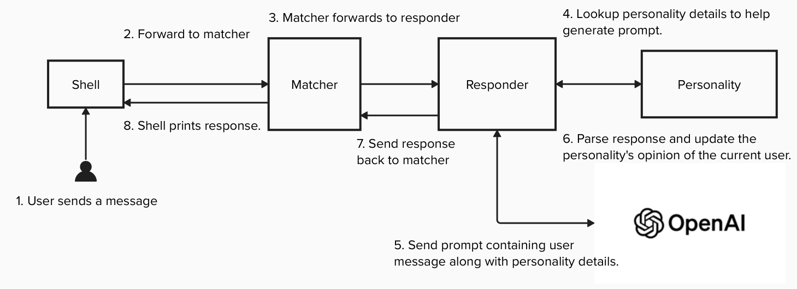

# matchbot
A command line chatbot where you can have a conversation, get to know each other, and see you can setup a date (or get rejected)

Requires Python 3.7+

## Quickstart:

1. Git clone this repo. CD to basedir location. 
2. `pip install -r requirements.txt`
3. `python bootstrap.py` One time setup of nltk per local machine.
4. Add matchbot basedir to PATH `export PATH=$PATH:/path/to/matchbot`
5. Add OpenAI API key to env `export OPEN_API_KEY=${API_KEY>}`
6. Run `matchbot`

## Commands

`/match [m|f|n] [18-100]`

Use to start a conversation with a new personality. Matchbot will auto generate this based on the gender specified
`m` (male) `f` (female) `n` (nonbinary). 

examples:
`/match f 25` --> female personality age 25.
`/match m 25-45` --> male personality between the age 25 and 45.
`/match n` --> non-binary personality between the age 18 and 100.

Age argument is optional. 

You can specify an exact age between `18` and `100` years old, or a range if you'd like to be
surprised. Format for range is dash-separated no spaces I.E. `25-45`.

`/save` to save the personality to `./saved_personality.dat`. This will let you reload later. This will overwrite any existing file with that name, so be sure to backup to a different location if you really don't want to lose the match!

`/load` to restore a personality for conversation using the file `./saved_personality.dat`

`/debug` to see details about the personality you're talking to, including current disposition. (hint: it's more fun if you don't use this).

`/help` --> print this menu

`/exit` to leave matchbot

## How it works

When matchbot creates a personality for conversation, it autogenerates a few random interests and personality traits from the data sources below. Some language processing is done to make sure randomly assigned personality traits are not conflicting. E.G. A personality will not be both happy and sad, or funny and boring.

Where the conversation goes from here is up to the user. 

Depending on how you talk with the personality it will gradually increase/decrease their opinion of you. Being overly crude, mean, and/or discussing topics that don't align with their interest will have a decreased effect. 

If their opinion of you gets low enough they'll suggest you talk with another person. There's a very low (but not zero) chance of recovering the conversation from here.

If the opinion gets really low, the personality will automatically unmatch you.

If you have a meaningful conversation and increase the personality's disposition of you high enough, they'll start suggesting you go on a date. Good job!

You can see how the personality currently feels about you by running `/debug` and observing the disposition between 0.0 and 100. Where 0 is a very negative opinion, and 100 is perfect.

## Design

Starting from the launch_cli.py top level, all printouts are done in the lauch_cli.py module. 
Any checked exceptions bubble up to this layer as well to printout a meaningful message to the user. This was done to prevent randomly scattered print() logs all over the codebase.

Once the user asks for a match, various decoupled components interact with each other. Age and Gender both have their own dedicated modules to handle generation. Gender takes in the raw /match command from the user and responds with the `gender, name`. Where name is randomly generated based on the gender. Age does the same thing but responds with just `years_old`.

From here a personality construct is created using `gender`, `name`, `years_old` and some randomly selected interests and non-conflicting personality traits. Male and Female names are selected from the language processing library's names module. Nonbinary names, personality traits, and interests all come from the data sources cited below.

Interaction between the user and personality involves three distinct design components. The matcher, the personality, and the responder.

### Matcher

Handles operations around loadin    g/saving/generation of personalities. The matcher is where the responder is instantiated and given a reference to the current personality. It's also where user inputs from the shell are forwarded to the responder for a response.

### Personality

All details of the person you're currently talking to. Currently includes: age, gender, current opinion of you, interests, and personality traits. (This will be expanded on over time)

### Responder

Takes a reference to the personality. When a user types something to the personality in conversation, the responder's job is to take that input and generate effective generativeAI prompts, based largely on the current details and traits within that personality. Currently there are only these responder types impemented:

1. GPTResponder: OPenAI gpt 3.5 turbo model.
2. Echo responder used only to printout the personality details for debugging.

Part of the prompt dictates that a response should include as the last sentance a score between 0.0 and 100 of how the personality felt about the message they just received. The responder contains some custom language processing code to parse this out of the AI response, before forwarding the rest of the response to the user. If for some reason the responder can't find the disposition score in the response, just send the response as-is and don't leave their current opinion of you unchanged.

### Conversation flow design diagram

## Next steps

* Dedicated memory contained within personality.
* Move disposition to memory.
* Remember your name in memory. 
* Get frustrated if the person keeps repeating themselves or asking the same questions over and over.
* If bot asks them on a date and they say yes, don't keep asking. Start talking about how they can't wait to see you.

## Run tests

`pytest tests`

## Data Sources

### Personality traits

https://argoprep.com/blog/206-personality-adjectives-to-describe-anybody/

### Nonbinary names

https://nameberry.com/list/851/nonbinary-names/all

### Interests

https://en.wikipedia.org/wiki/List_of_hobbies