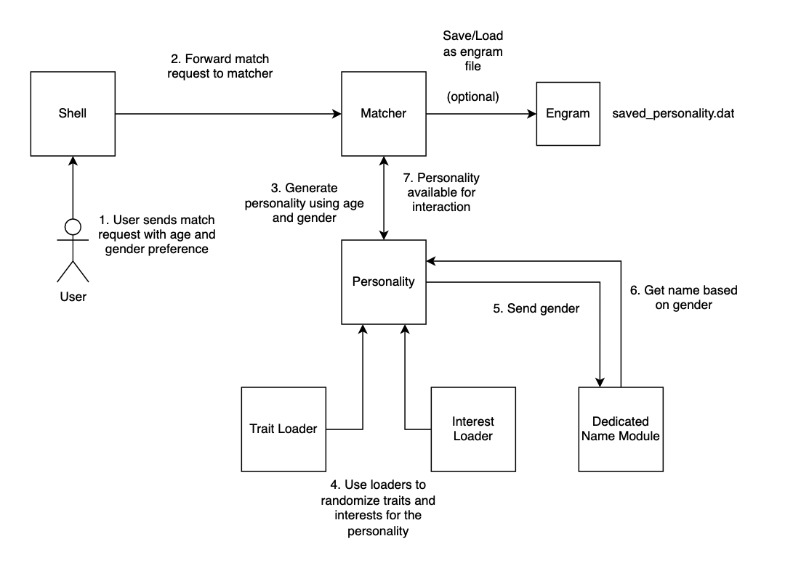

# matchbot
A command line chatbot where you can have a conversation, get to know each other, and see you can setup a date (or get rejected)

Requires Python 3.7+

OpenAI version is now stored in branch `openai_support`. The main branch and directions now run with ollama.

## Screenshots of usage (user input is left-justified starting with '>')

## Quickstart:

1. Git clone this repo. CD to basedir location. 
2. `pip install -r requirements.txt`
3. `python bootstrap.py` One time setup of nltk per local machine.
4. Add matchbot basedir to PATH `export PATH=$PATH:/path/to/matchbot`
5. Get [Ollama](https://ollama.com/) and launch.
6. Run `ollama pull llama3`
7. Run `matchbot`

## Commands

`/match [m|f|n] [18-100]`

Use to start a conversation with a new personality. Matchbot will auto generate this based on the gender specified
`m` (male) `f` (female) `n` (nonbinary). 

examples:
`/match f 25` --> female personality age 25.
`/match m 25-45` --> male personality between the age 25 and 45.
`/match n` --> non-binary personality between the age 18 and 100.

Age is an optional argument. If not supplied the program will generate a personality between 18 and 100 years of age (inclusive). 

You can specify an exact age between `18` and `100` years old, or a range if you'd like to be
surprised. Format for range is dash-separated no spaces I.E. `25-45`.

`/save` to save the personality to `./saved_personality.dat`. This will overwrite any existing file with that name, so be sure to backup to a different location if you really don't want to lose the match!

`/load` to restore a personality for conversation using the file `./saved_personality.dat`

`/debug` to see details about the personality you're talking to, including current disposition. (hint: it's more fun if you don't use this).

`/help` --> print this menu

`/exit` to leave matchbot

## How it works

When matchbot creates a personality for conversation, it autogenerates a few random interests and personality traits from the data sources below. Some language processing is done to make sure randomly assigned personality traits don't conflict. E.G. A personality will not be both happy and sad, or funny and boring.

Where the conversation goes from here is up to the user. 

Depending on how you talk with the personality it will gradually increase/decrease their opinion of you. Being overly crude, mean, and/or discussing topics that don't align with their interests will have a decreased effect. 

If their opinion of you gets low enough they'll suggest you talk with another person. There's a very low (but not zero) chance of recovering the conversation from here.

If the opinion gets really low, the personality will automatically unmatch you.

If you have a meaningful conversation and the personality's opinion of you gets high enough, they'll start suggesting you go on a date. Nice work!

You can see how the personality currently feels about you by running `/debug` and observing the disposition between 0.0 and 100.0. Where 0 is a very negative opinion, and 100 is perfect.

## Design

launch_cli.py is the top level module with the user input loop. All printouts to the user are done here. 
Any checked exceptions bubble up to this layer as well to printout a meaningful message to the user. This was done to prevent randomly scattered print() logs all over the codebase.

Once the user asks for a match, a random personality is generated that matches the user's preference for gender and age. The gender component takes in the raw /match command from the user and responds with the `gender, name`. Where name is randomly generated based on the gender. The age component does the same thing but responds with just `years_old`.

From here a personality construct is created using `gender`, `name`, `years_old` and some randomly selected interests and non-conflicting personality traits. Male and female names are selected from the language processing library's names module. Nonbinary names, personality traits, and interests all come from the data sources cited below.

From here forward, interaction between the user and personality involves three distinct design components. The matcher, the personality, and the responder.

### Matcher

Handles operations around generation and persistance of personalities. The matcher is where the responder is instantiated and given a reference to the current personality. It's also where user messages are forwarded to the responder to generate a response back to the user. Ghosting is not a behavior encoded into the personalities, although maybe I should?

### Personality

Contains the details of the match. Currently includes: age, gender, libido, current opinion of you, interests, and personality traits, and conversational history.

Personalities can be saved to engram files as a .dat and reloaded later. When reloaded, the personality will use your conversation history as part of the completion prompt to generate a nice welcome back message. 

### Responder

Takes a reference to the personality. When a user sends a message to the personality, the responder's job is to take that input and generate effective generativeAI prompts, based largely on the current details and traits within that personality. Currently there are only these responder types impemented:

1. OllamaResponder: Ollama 3 8B
2. Debug responder used only to printout the personality details on /debug command.
3. Echo responder which just returns back whatever was sent.

The response is sent to the LLM to determine on a scale of 0.0 -> 100.0 how the personality felt about what was just said. 

This is to help the personality track their opinion of you as the conversation progresses.

User input and responses are saved as conversation history. The history is used to help the personality remember details of the conversation as things progress, even across different interactive sessions.

## Design diagrams

### Create personality

### Conversation flow 

### Save/Load engram

## Next steps

* Work on a more compelling interactive UI.

## Run tests

`pytest tests`

## Data Sources

### Personality traits

https://argoprep.com/blog/206-personality-adjectives-to-describe-anybody/

### Nonbinary names

https://nameberry.com/list/851/nonbinary-names/all

### Interests

https://simple.wikipedia.org/wiki/List_of_hobbies
